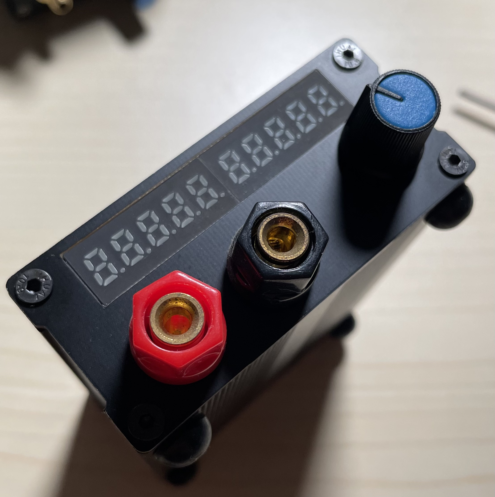

# AD5791/AD5781 Voltage Reference Generator

## Introduction

This full open source precision voltage reference generator consists of LM399 as reference and AD5781/5791 DAC.

Resistors used to convert LM399 voltage to 10V is ten 0805 resistors with specification of 20ppm/C. The tested temperature coefficient is around 5ppm/C under 0~60 degree C. The whole device is around 3ppm/C.

## Highlights

- Cheap. Both AD5781 and LM399 can be reached with pretty low prices, and 20ppm/C resistors are super cheap.
- Full open source. This repo consists of all the sources(links) include hardware to replicate.
- Portable. Palm-sized device with 220V as main supply.

## Hardware

Main reference: LM399 with statistic resistors booted up to 10V

DAC: AD5791/AD5781

ADT7420: internal temperature monitor(can be omitted)

Display: 10 digits segments LED display

MainController: STM32F030

USB to isolated UART for remote control

Encoder for manual control

## Gallery

## Test Result

1. INL

2. Temp-drift

3. TBD

